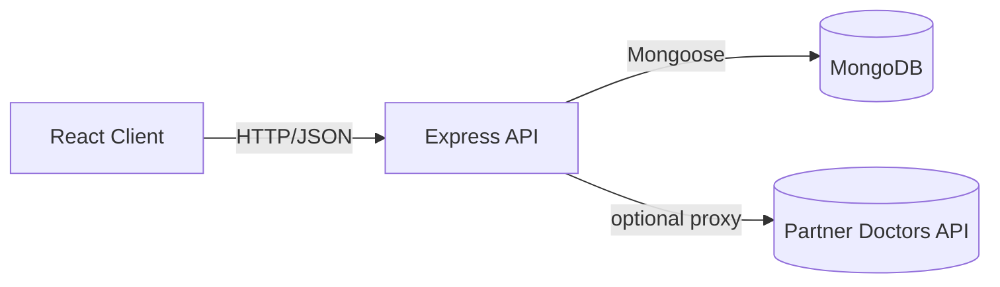

# HealthMonitor Zambia: Project Report

## Abstract
HealthMonitor Zambia is a MERN-stack application that enables users to manage personal health data, discover Zambian doctors, and book appointments. It implements secure authentication, persistent storage with MongoDB, a responsive React + Bootstrap frontend, and Zambia-specific validations (phone, cities). The system supports both local doctor data and an optional partner API. This report documents requirements, design, implementation, testing, results, and future work.

## Objectives
- **Authentication & Profiles**: User registration/login with JWT, profile management.
- **Health Records**: Create and view personal health records and metrics.
- **Doctor Discovery (Zambia)**: Filter/search doctors by specialization, city, rating, and fee.
- **Appointments**: Book and manage appointments with available time slots.
- **Admin**: Manage users (roles) and doctors (create/edit/delete).
- **Non-Functional**: Security (validation, auth), responsive UI, clear error handling, extensible design.

## Architecture Overview
- **Frontend**: React 19, React Router, React-Bootstrap, Chart.js, React-Toastify.
- **Backend**: Node.js, Express.js, Mongoose, express-validator, bcryptjs, CORS.
- **Database**: MongoDB Atlas.
- **Optional Partner**: Proxy routes to partner provider directory.

## Key Directories and Files
- **Backend**
  - `server.js`: App bootstrap, Mongo connection, routes, static serving (prod only).
  - `routes/`: `auth.js`, `doctors.js`, `appointments.js`, `health.js`, `admin.js`, `partner.js`.
  - `models/`: `User.js`, `Doctor.js`, `Appointment.js`, `HealthRecord.js`.
  - `middleware/`: `auth.js` (JWT), `roles.js` (RBAC).
  - `constants/zambia.js`: Canonical city list used for filtering.
  - `scripts/`: `seedDoctors.js`, `importDoctorsFromCsv.js`.
- **Frontend**
  - `client/src/App.js`: Routes with `PrivateRoute` protection.
  - `client/src/context/AuthContext.js`: Auth state, login/register with robust error handling.
  - `client/src/components/Doctors/Doctors.js`: Listing with filters, Zambia dummy fallback.
  - `client/src/components/Doctors/DoctorProfile.js`: Profile, supports dummy doctors via route state.
  - `client/src/components/Appointments/BookAppointment.js`: Booking flow; demo-safe for dummy IDs.
  - `client/src/components/Admin/`: `AdminUsers.js`, `AdminDoctors.js`.

## Data Models (Summary)
- **User** (`models/User.js`)
  - name, email (unique), password (hashed), age, gender [male|female|other], phone (Zambia regex), role [patient|doctor|admin], timestamps.
- **Doctor** (`models/Doctor.js`)
  - name, specialization (enum), qualifications[], experience, hospital {name,address,city,...}, contactInfo, availability[], consultationFee, rating {average,count}, isActive.
- **Appointment** (`models/Appointment.js`)
  - patientId, doctorId, appointmentDate, timeSlot, status, reason, symptoms[], timestamps.
- **HealthRecord** (`models/HealthRecord.js`)
  - userId, date, type, notes, metrics, attachments, timestamps.

## APIs (Representative)
- **Auth**: `POST /api/auth/register`, `POST /api/auth/login`, `GET /api/auth/me`.
- **Doctors**: `GET /api/doctors`, `GET /api/doctors/meta/{specializations|cities}`, `GET /api/doctors/:id`, `POST /api/doctors/:id/review`.
- **Appointments**: `GET /api/appointments`, `POST /api/appointments/book`, `GET /api/appointments/slots/:doctorId/:date`.
- **Health**: `GET /api/health/records`, `POST /api/health/records`.
- **Admin**: `GET /api/admin/users`, `PUT /api/admin/users/:id/role`, `GET /api/admin/doctors`, `POST /api/admin/doctor`, `PUT /api/admin/doctor/:id`, `DELETE /api/admin/doctor/:id`.
- **Partner** (optional): `GET /api/partners/doctors`, `GET /api/partners/search/:q`.

## Zambia-Specific Behavior
- **Phone Validation**: `^(\+?260|0)9\d{8}$` enforced on registration and admin forms.
- **City Filtering**: Doctor queries constrained to `constants/zambia.js` list by default.
- **Demo Data**: Seed and embedded dummy data use Zambia hospitals and cities.

## Notable Implementation Details
- **Auth Context Error Handling** (`client/src/context/AuthContext.js`)
  - Extracts server-side validation arrays (`errors[]`) and falls back to a generic message.
- **Prod vs Dev Static Serving** (`server.js`)
  - Serves `client/build` only when `NODE_ENV=production` to avoid ENOENT in dev.
- **Doctors Page Fallback** (`Doctors.js`)
  - Shows embedded Zambia dummy doctors immediately; attempts background fetch; gracefully falls back on error.
- **Profile & Booking Demo Support**
  - `DoctorProfile.js` and `BookAppointment.js` can render for demo IDs (e.g., `zm-1`) without backend access; booking simulates success for demo doctors.
- **Admin Doctors** (`AdminDoctors.js` + routes)
  - Create, edit, delete doctors (secured with auth + admin role).

## Security
- **AuthN/Z**: JWT bearer tokens; role checks via `requireRole()` middleware.
- **Validation**: `express-validator` on sensitive routes (auth, reviews, admin updates).
- **Recommendations**: Add `helmet`, rate limiting on auth routes, strict CORS in production, sanitization.

## UI/UX & Accessibility
- **Responsive**: Bootstrap grid/components for mobile/desktop.
- **Feedback**: React-Toastify toasts, spinners for loading.
- **A11y Tips**: Replace decorative anchors with buttons; ensure valid hrefs.

## Testing Strategy
- **Server**: Jest + Supertest for route handlers and validation; consider `mongodb-memory-server`.
- **Client**: React Testing Library for forms and components; mock axios.
- **Manual**: End-to-end checks for register/login, doctor search, booking, and admin flows.

## Setup & Run
1. **Environment** (`.env` at project root)
   - `MONGODB_URI=mongodb+srv://<user>:<pass>@<cluster>/<db>?retryWrites=true&w=majority&appName=health`
   - `JWT_SECRET=<strong-secret>`
   - `EMAIL_USER=<email>` (optional)
   - `EMAIL_PASS=<app-password>` (optional)
   - `NODE_ENV=development`
   - Optional partner: `USE_PARTNER_DOCTORS`, `PARTNER_API_BASE`, `PARTNER_API_HOST`, `PARTNER_API_KEY`
2. **Client Env** (`client/.env`)
   - `PORT=3001`
   - `BROWSER=none`
   - Optional: `REACT_APP_USE_PARTNER_DOCTORS=true|false`
3. **Install**
   - From root: `npm install` and `cd client && npm install`
4. **Run (Dev)**
   - From root: `npm run dev` (concurrently starts server and client)
5. **Seed (Optional)**
   - `node scripts/seedDoctors.js`

## Results
- Auth and profiles operational with robust error messaging.
- Health records CRUD functional.
- Doctor listing and profiles working with Zambia dummy data fallback; partner/local switch supported.
- Appointment booking flow functional; demo mode simulates bookings.
- Admin screens for users and doctors implemented.

## Limitations
- Real partner API integration requires credentials and schema adaptation.
- Email verification/password reset not yet implemented.
- Advanced scheduling (double-booking prevention, calendar sync) not yet enforced at the DB level.

## Future Work
- Email verification and password reset flows.
- Rate limiting, `helmet`, strict CORS, and sanitization.
- Reminders/notifications (e.g., `node-cron`) and real-time updates.
- Observability (request logging, error tracking, `/healthz`).
- A11y improvements and expanded automated test coverage.
- Production deployment (Docker/CI-CD) and monitoring.

## References
- React: https://react.dev
- Express: https://expressjs.com
- MongoDB: https://www.mongodb.com/docs
- Bootstrap: https://getbootstrap.com
- express-validator: https://express-validator.github.io
- React-Toastify: https://fkhadra.github.io/react-toastify
